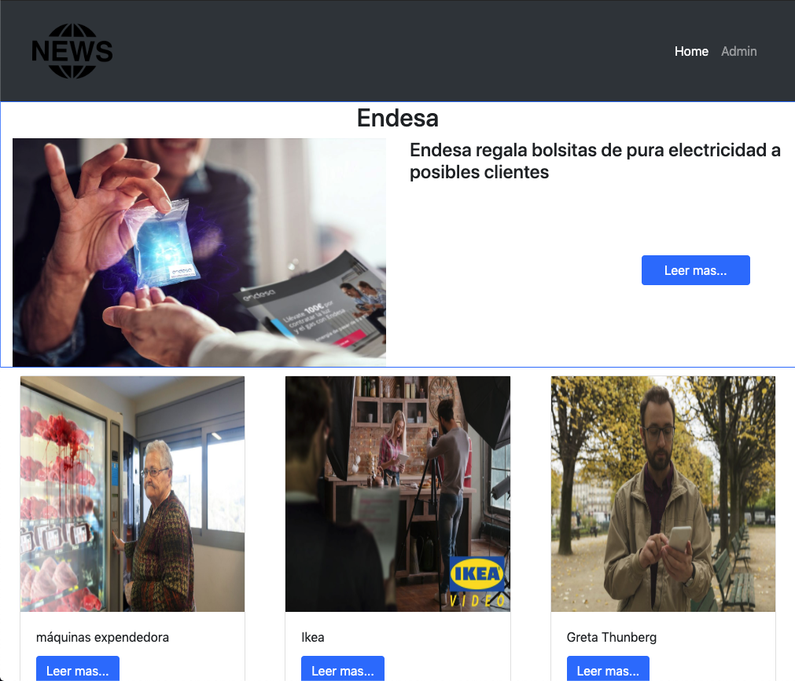
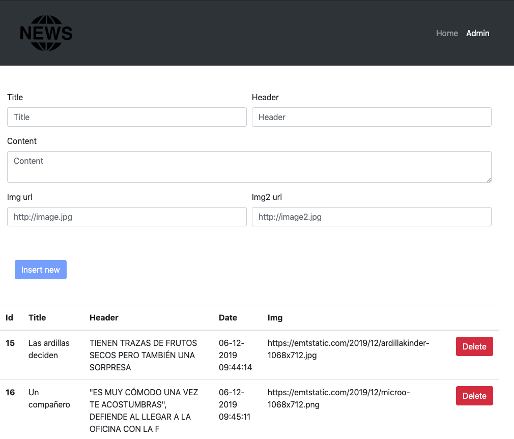

# Fake News (University project)



> Vamos a desarrollar el frontend de una web de noticias que cumpla con las siguientes características:
>
> - Tendremos dos portales: uno para acceder como lector y poder consultar las noticias y otro para acceder como periodista y gestionar el contenido (crear y eliminar noticias)
> - En el portal de lectura:
> - Mostraremos las 10 noticias más recientes por orden, estando primero la más
>   reciente.
> - La primera noticia ocupará todo el ancho de la página, y se mostrará en un
>   tamaño extendido su foto, titular y heading
> - El resto de noticias se mostrarán en un tamaño más reducido, pudiendo caber
>   varias noticias en diferentes columnas. En este caso, únicamente veremos su foto y titular.
> - Si pulsamos sobre cualquier noticia, iremos a su vista de detalle, en la que tendremos que ver todo su contenido.
> - En el portal de gestión, tendremos un listado con todas las noticias existentes en nuestra base de datos.
> - En él podremos crear nuevas noticias o eliminar noticias existentes.
> - Si eliminamos una noticia, debemos de tener el feedback visual correspondiente.
> - Si pulsamos en el botón de “Añadir noticia”, iremos a una nueva página que nos mostrará un formulario donde podremos rellenar los campos de titular, heading, contenido, url de imagen y url de imagen alternativa.
> - Este formulario tendrá que hacer las siguientes validaciones:
> - En tiempo real, mientras rellenas los campos, verificar que la longitud de
>   los campos no exceda las siguientes dimensiones: título 20 chars, header 80 y content 5000.
> - Al pulsar el botón de enviar, antes de hacer el envío, tiene que asegurarse de que los campos estén rellenos.
> - Para empezar, podemos realizar la gestión de noticias desde el panel de administración de Django, ubicado en http://127.0.0.1:8000/admin
> - El usuario del portal de administración es inso y su contraseña utad2019

## Instalación del back-end(python)

```bash
pip3 install virtualenv
virtualenv venv
source venv/bin/activate
pip install -r requirements.txt
python3 manage.py runserver
```

Ha tener en cuanta que enpoint de la API son las siguientes ya que esta en local:

```
GETall: http://127.0.0.1:8000/api/noticia/
POST: http://127.0.0.1:8000/api/noticia/ + idNew + /
GET: http://127.0.0.1:8000/api/noticia/ + idNew + /
DELETE: http://127.0.0.1:8000/api/noticia/ + idNew + /
```

## Instalación del front (html,css,js,jquery, ajax, boostrap)

Solo tenemos que lanzar ./noticias/index.html despues de instalar y lanzar el back y la web funcionará.
Ahora mismo está montado en local por lo que la url de conexión con la api seria`http://127.0.0.1:8000/api/noticia/`




## Contributing

Pull requests are welcome. For major changes, please open an issue first to discuss what you would like to change.

Please make sure to update tests as appropriate.

## License

[MIT](https://choosealicense.com/licenses/mit/)
